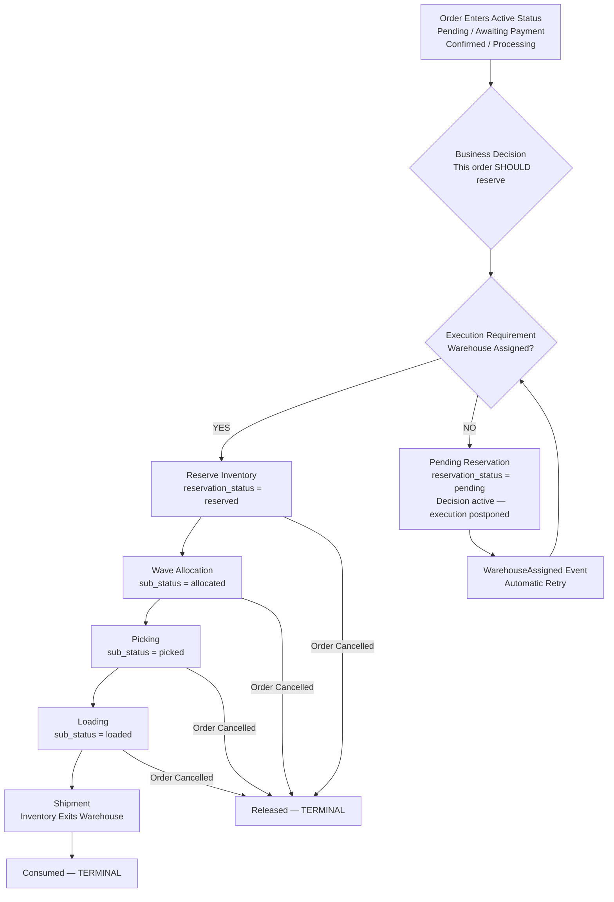
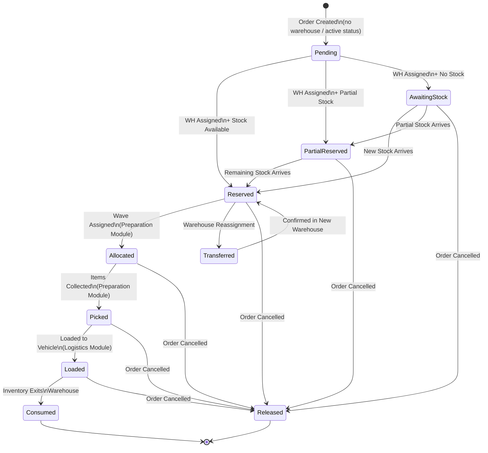

# ADR-027: Reservation Ownership Policy — v1.3

**Status:** Approved  
**Version:** v1.1  
**Date:** 2026-07-21  
**Author:** Engineering Architecture Review  
**Inputs:** TASK-RESERVATION-POLICY-AUDIT-001, TASK-RESERVATION-RUNTIME-TRACE-002, CTO Review  
**Supersedes:** ADR-027 v1.0 (2026-07-21)

---

## Revisions from v1.2 to v1.3

| Section | Change |
|---|---|
| Section 3 | Raw-material clause SUPERSEDED — reservation now derives RM requirements from the active BOM (see Section 17) |
| Section 11 | SUPERSEDED — order-driven Raw Material reservations now exist (see Section 17) |
| Section 13 | P04 superseded by P04-v1.3 (see Section 17.7) |
| Section 14 | P04 compliance row inverted (see Section 17.7) |
| Section 16.2 | **UNCHANGED and still in force** — see Section 17.6 |
| Section 17 | **NEW** — Order-Driven Raw Material Reservation |

---

## Revisions from v1.1 to v1.2

| Section | Change |
|---|---|
| Section 3 | Case 2 amended — pointer to Section 16 added; table otherwise unchanged |
| Section 16 | **NEW** — Option B recipe gate, F4 company scoping, cross-brand Raw Material reuse |

---

## Revisions from v1.0 to v1.1

| Section | Change |
|---|---|
| Section 2 | Business Decision / Execution Requirement separated; architecture flowchart added |
| Section 4 | "Reservation ends at Preparing" removed; reservation now persists through Shipment |
| Section 5 | Preparation allocates (Reserved→Allocated→Picked); consumption belongs to Logistics |
| Section 8 | Three new states: Allocated, Picked, Loaded |
| Section 9 | Status matrix: reservation sub-state column; Logistics ownership row |
| Section 13 | P16 added; P06 updated |
| Section 14 | P06 → PARTIAL; P16 → PARTIAL; summary updated |

---

## Context

Two completed runtime investigations exposed structural inconsistencies in ECOS ERP's reservation system:

- **AUDIT-001** — Reservation logic fragmented across four modules with no formal ownership boundaries.
- **TRACE-002** — Runtime evidence of 9+ legacy orders in active status with no reservation and no warehouse; two production-level bugs confirmed in `DirectIssueStockAction` and `AnalyzeMaterialsAction`.
- **CTO Review** — Two conceptual clarifications: (1) the business decision to reserve precedes the ability to execute it; (2) reservation must survive the full operational pipeline until inventory physically leaves the warehouse.

This ADR is the single authoritative policy governing all inventory reservation decisions. Where any existing code conflicts with this ADR, the code must be refactored to comply.

---

## Section 1 — Reservation Ownership

**Decision: The Orders Module is the sole owner of all reservation lifecycle decisions.**

| Responsibility | Owner | Class / Table |
|---|---|---|
| Decide when to reserve (Business Decision) | Orders Module | Triggered by order entering active status |
| Decide whether to reserve (Execution) | Orders Module | `ReserveOrderInventoryAction` (3-case logic) |
| Execute stock mutation | Inventory Module | `ReserveStockAction` → `stock_ledger_entries` |
| Track reservation state | Orders Module | `orders.reservation_status`, `order_reservation_audits` |
| Track line-level reserved qty | Orders Module | `order_lines.reserved_qty` |
| Allocate reservation to wave | Preparation Module | Transitions Reserved → Allocated |
| Progress through picking and loading | Preparation / Logistics | Transitions Allocated → Picked → Loaded |
| Consume reservation at shipment | Logistics / Inventory | Inventory exits warehouse → Consumed |
| Release reservation (cancel) | Orders Module | `ReleaseOrderInventoryAction` |

The Inventory Module is a **pure executor**: it applies mutations, writes ledger entries, emits events. It never evaluates business policy.

The Manufacturing Module has **no reservation authority**. It responds to the reservation that Orders has already committed.

---

## Section 2 — Reservation Start Point

**Decision: The Business Decision to reserve is separate from the Execution Requirement. The decision is immediate; the execution is conditional.**

### Business Decision

The system makes the reservation decision the moment an order enters any active commercial state:

- Pending
- Awaiting Payment
- Confirmed
- Processing

The business decision is: *"This order should reserve inventory."* This decision is recorded immediately. It is not contingent on warehouse availability.

### Execution Requirement

Reservation can only be physically executed when `assigned_warehouse_id` is present. If warehouse is missing at the moment of the decision:

- Reservation Decision: **active** (intent recorded)
- Reservation Execution: **postponed**
- `reservation_status` remains `pending` — meaning: *decision made, execution pending*

As soon as a `WarehouseAssigned` event fires for the order, execution must automatically retry.

### Architecture Flow



### Trigger Events

| # | Trigger | Current State | Required Action |
|---|---|---|---|
| 1 | Order creation — warehouse already assigned | **Exists** | Auto-reserve in `CreateManualOrderAction` |
| 2 | Warehouse assignment resolves for existing order | **Missing** | New: `WarehouseAssigned` event → reservation retry listener |
| 3 | New stock arrives for product with `awaiting_stock` orders | **Missing** | New: `StockReceived` event → reservation retry queue job |

Reservation is **non-blocking**. It never prevents order progression. If stock is unavailable, the order transitions to `awaiting_stock` and the status pipeline continues.

| Order Status | Business Decision | Execution Condition |
|---|---|---|
| Pending | YES — reserve intent active | On warehouse assignment |
| Awaiting Payment | YES | On warehouse assignment |
| Confirmed | YES | On warehouse assignment or at confirmation workflow |
| Processing | YES | On warehouse assignment or at processing workflow |
| Preparing | Inherited | Reservation already executed; lifecycle continues |
| Ready / Shipped / Delivered | N/A | Post-reservation stages |
| Cancelled | N/A | Release, not reserve |

---

## Section 3 — Reservation Dependency

**Decision: Reservation depends ONLY on Finished Good (FG) availability. Raw material availability is irrelevant at reservation time.**

> ⚠️ **The raw-material clause of this decision is SUPERSEDED by Section 17 (v1.3).**
> Reservation now derives raw-material requirements from the active Recipe/BOM and reserves
> them. The FG decision tree below is otherwise unchanged, and Case 1 still evaluates first.

Reservation is a commercial commitment. Manufacturing is the operational mechanism that delivers on it. These are separate concerns.

**FG Availability Formula (universal, non-negotiable):**

```
available = on_hand_qty − reserved_qty
```

**Reservation Decision Tree:**

| Condition | Case | Reservation Action | Physical Lock |
|---|---|---|---|
| `available ≥ requested_qty` | Case 1 — Standard | Physical reservation via `ReserveStockAction` | YES |
| `can_manufacture = true` | Case 2 — Manufacturing | Logical commit — full qty reserved, zero physical lock | NO |
| `allow_negative_stock = true` AND `available = 0` | Case 3 — Negative Stock | Logical commit — OH will go negative at shipment | NO |
| None of the above | Case 4 — Awaiting | `reservation_status = awaiting_stock` | NO |

> ⚠️ **Case 2 is amended by Section 16** (v1.2, Option B, owner-approved 2026-08-09).
> `can_manufacture = true` no longer commits *unconditionally* — it commits only when the
> recipe is actually executable. Cases 1, 3 and 4 are unchanged, and Case 1 still evaluates
> first, so physical FG stock is never gated by the recipe. See Section 16.

---

## Section 4 — Manufacturing Responsibility

**Manufacturing starts at:** `MoveToPreparationWorkflow` → `PrepareOrderManufacturingAction`

**Reservation persists through the entire operational pipeline.** It is not consumed when an order enters Preparing status, nor when manufacturing begins. Reservation is consumed exclusively when inventory physically exits the warehouse at shipment.

| Layer | Module | Class | Responsibility |
|---|---|---|---|
| Decision | Commerce/Orders | `ReserveOrderInventoryAction` | Decides whether and how to reserve |
| Execution | Inventory | `ReserveStockAction` | Applies the stock mutation |
| Execution | Inventory | `DirectIssueStockAction` | Decrements OH at shipment (consumes reservation) |
| Audit | Inventory | `stock_ledger_entries` | Immutable mutation log |
| Trigger | Operations/Preparation | `PrepareOrderManufacturingAction` | Decides if production is needed |
| RM Analysis | Operations/Preparation | `AnalyzeMaterialsAction` | Evaluates RM availability (must use OH − RES) |

Manufacturing **never** modifies `orders.reservation_status`. It reads the reservation as given and produces finished goods against the committed quantity.

---

## Section 5 — Preparation Responsibility

**Preparation allocates reservations to waves and tracks picking progress. It does not consume or release reservations. Consumption belongs to Logistics at shipment.**

**Preparation OWNS:**
- Wave lifecycle (planning → allocation → picking → pooling → loading)
- RM availability analysis via `AnalyzeMaterialsAction` (must read `on_hand − reserved`)
- Manufacturing triggers
- Transitioning reservation: `Reserved → Allocated` when wave is assigned
- Transitioning reservation: `Allocated → Picked` when items are physically collected
- Pick list generation against reserved/allocated stock

**Preparation MUST NEVER:**
- Call `ReserveOrderInventoryAction` or `ReserveStockAction`
- Consume or release reservations (`reserved_qty` decrement belongs to Logistics/Shipment)
- Include orders with `reservation_status = pending` in a wave
- Bypass the Orders reservation state machine

---

## Section 6 — Negative Stock Policy

**Decision: For `allow_negative_stock = true` products, the system must execute every stage including issuance that takes `on_hand_qty` below zero.**

| Stage | Current Behaviour | Official Policy | Gap |
|---|---|---|---|
| Reservation (avail > 0) | Physical reservation | APPROVED | None |
| Reservation (avail = 0, allow_neg) | Case 3: logical commit | APPROVED | None |
| Shipment (DirectIssue) | Throws `InsufficientStockException` | Must proceed; OH goes negative | **CRITICAL BUG** |
| Inventory (OH) | Blocked before negative | `on_hand_qty` may be negative | **CRITICAL BUG** |
| Ledger | No entry (blocked) | Ledger entry with negative qty | **CRITICAL BUG** |

**Approved flow for allow_negative_stock=true:**

```
Reservation: reserved_qty += qty, on_hand UNCHANGED, reservation_status = reserved
  ↓ [Allocation] → [Picking] → [Loading] → reservation_status stays 'reserved'
  ↓
At Shipment (DirectIssueStockAction):
  Check products.allow_negative_stock
  If TRUE  → proceed; on_hand_qty -= qty (may go negative); ledger entry written; reservation consumed
  If FALSE → throw InsufficientStockException (existing behaviour, correct)
```

---

## Section 7 — Inventory Quantities

| Quantity | Definition | Column | Changes When |
|---|---|---|---|
| On Hand | Physical units confirmed present in warehouse | `inventory_items.on_hand_qty` | Receiving (+), Issuing (−), Adjustment (±) |
| Reserved | Units committed to unfulfilled orders | `inventory_items.reserved_qty` | Reservation (+), Release (−), Consumed at shipment (−) |
| Available | What can be promised to new orders | *Computed — no column* | Derived: `on_hand_qty − reserved_qty` |
| Allocated | Reserved units assigned to a specific wave | Wave allocation tables | Wave assignment (+), completion/cancel (−) |
| In Production | Units in open manufacturing orders | Production tables | Production open (+), completed (→ OH) |
| In Transit | Units on open inbound POs | PO tables | PO issued (+), received (→ OH) |

**Mathematical relationships:**

```
available        = on_hand_qty − reserved_qty
net_available    = available + in_transit_qty + in_production_qty
soft_committed   = reserved_qty         (all unfulfilled orders)
hard_committed   = allocated_qty        (wave-assigned subset)
uncommitted      = available − allocated_qty
```

---

## Section 8 — Reservation States

**Ten states (seven reservation states + three operational sub-states). Two terminal. No backward transitions. Every change requires an audit entry.**

> Note: Allocated, Picked, and Loaded are operational sub-states within the broader `reserved` ownership. The `inventory_items.reserved_qty` does not change during these transitions — only the operational tracking state changes.



**State Reference:**

| State | Business Meaning | Owner | Entry Rule | Exit Rule |
|---|---|---|---|---|
| **Pending** | Decision made; execution postponed (no warehouse) | Orders Module | Initial state; warehouse not assigned | WH assigned → retry execution |
| **Reserved** | Commercial commitment; stock physically locked | Orders Module | All lines: `reserved_qty = quantity` | Wave → Allocated; Cancel → Released |
| **Partial Reserved** | Some lines or partial qty reserved | Orders Module | ≥1 line with `reserved_qty < quantity` | Stock arrives → Reserved; Cancel → Released |
| **Awaiting Stock** | Reservation attempted; stock insufficient | Orders Module | available < requested AND no override | New stock → Reserved; Cancel → Released |
| **Allocated** | Reservation assigned to a wave | Preparation Module | Wave assignment confirmed | Picking starts → Picked; Cancel → Released |
| **Picked** | Items physically collected from warehouse | Preparation Module | Pick list completed | Loading begins → Loaded; Cancel → Released |
| **Loaded** | Items on vehicle, awaiting departure | Logistics Module | Loaded to vehicle | Inventory exits warehouse → Consumed; Cancel → Released |
| **Transferred** | Reservation moved to different warehouse | Orders Module | Warehouse reassignment | Confirmed in new WH → Reserved |
| **Released** | Stock returned to available pool (terminal) | Orders Module | Order cancelled or explicit release | Terminal |
| **Consumed** | Reservation fulfilled; inventory has left warehouse (terminal) | Logistics / Inventory | `DirectIssueStockAction` executed at shipment | Terminal |

---

## Section 9 — Status Matrix

**Decision: One matrix governs which operations are permitted and which reservation sub-state applies at each order status. This matrix is the law.**

| Order Status | Reservation Sub-state | Reserve Inventory | Allocate | Pick | Load | Consume (Ship) | Release | Primary Owner |
|---|---|:---:|:---:|:---:|:---:|:---:|:---:|---|
| Pending | Pending | On WH assign | ✗ | ✗ | ✗ | ✗ | ✗ | Orders |
| Awaiting Payment | Pending | On WH assign | ✗ | ✗ | ✗ | ✗ | ✗ | Orders |
| Confirmed | Pending / Reserved | On WH assign | ✗ | ✗ | ✗ | ✗ | ✗ | Orders |
| Processing | Reserved | Auto-reserved | ✗ | ✗ | ✗ | ✗ | ✗ | Orders |
| Preparing | Reserved → Allocated → Picked | Inherited | **OWNS** | **OWNS** | ✗ | ✗ | ✗ | Preparation |
| Ready | Loaded | Inherited | ✗ | ✗ | **OWNS** | ✗ | ✗ | Logistics |
| Out For Delivery | Loaded | Inherited | ✗ | ✗ | — | ✗ | ✗ | Logistics |
| Delivered | Consumed | ✗ | ✗ | ✗ | ✗ | **OWNS** | ✗ | Logistics / Inventory |
| Cancelled | Released | ✗ | ✗ | ✗ | ✗ | ✗ | **OWNS** | Orders |

**Key:** `On WH assign` = fires when warehouse is assigned (execution phase); `Inherited` = reservation carried over from prior status; `OWNS` = this module owns this operation; `—` = already complete.

---

## Section 10 — Warehouse Assignment

**Decision: Warehouse assignment is the Execution Requirement, not the Business Decision trigger.**

| Scenario | Policy |
|---|---|
| Warehouse resolved at creation | Auto-reserve fires within `CreateManualOrderAction` |
| Warehouse resolved later | `WarehouseAssigned` event must trigger reservation retry (missing — must be added as H3) |
| No coverage for governorate | `warehouse_assignment_source = 'unassigned'` + `reservation_status = pending` — Command Center signal, not an error |
| Multi-warehouse order | Not permitted. Multi-warehouse fulfilment requires order splitting. Each order has one warehouse and one complete reservation. |

---

## Section 11 — Raw Materials

**Decision: Raw Material reservations do not exist in the ECOS Orders reservation system.**

> ⚠️ **SUPERSEDED by Section 17 (v1.3).** The premise below — *"Multiple BOMs may apply;
> Orders cannot know"* — no longer holds: `Product::activeRecipe()` resolves exactly one
> recipe deterministically. This section is retained as the historical record of why the
> FG-only rule was correct when written.

| Question | Answer | Rationale |
|---|---|---|
| Should RM reservations exist in Orders system? | **NO** | Multiple BOMs may apply; production scheduler selects. Orders cannot know. |
| Does current Case 2 (can_manufacture) inspect RM? | **CORRECT (PASS)** | `ReserveOrderInventoryAction` Case 2 does not query RM inventory — approved. |
| Can RM products be ordered directly? | YES — as a product | RM-WOOD-001 confirmed reservable (TRACE-002). Its `reserved_qty` must be excluded from `AnalyzeMaterialsAction` availability. |
| What formula must `AnalyzeMaterialsAction` use? | `SUM(on_hand) − SUM(reserved)` | Current: `SUM(on_hand_qty)` only — ignores direct RM order reservations. **HIGH BUG.** |

**RM Ownership by Stage:**

| Stage | RM Owner | RM Action |
|---|---|---|
| Reservation | None | RM is invisible to the reservation system |
| Preparation / Wave Planning | Preparation Module | `AnalyzeMaterialsAction` evaluates RM availability (OH − RES) |
| Manufacturing | Manufacturing Module | RM consumed via production process |
| RM Shortage | Command Center (ADR-010) | Signal raised, procurement triggered |

---

## Section 12 — Legacy Data Policy

**Decision: Legacy orders must be reprocessed via a supervised background job.**

**Definition:** Orders in status `processing`, `confirmed`, or `preparing` where `assigned_warehouse_id IS NULL` AND `reservation_status = 'pending'` with no audit trail. Confirmed: ORD-00023, ORD-00024.

| Condition | Required Action |
|---|---|
| Active status, WH=null, never shipped | Run `BranchAssignmentEngine` → if WH resolved, attempt reservation |
| Active status, WH=null, WH unresolvable | Flag in Command Center as "No Coverage Exception" |
| Active status, WH assigned, `reservation_status = pending` | Immediate reservation retry |
| Active status, order already waved without reservation | Check `wave_assignments` first — prevent double-allocation. If already waved: mark consumed retroactively, write audit entry. |
| Terminal status (delivered, cancelled) | Mark as historical record. Write retroactive audit noting legacy status. |

---

## Section 13 — Architecture Principles

| Code | Principle | Detail |
|---|---|---|
| P01 | Reservation belongs to Orders Module | Only `Modules\Commerce\Orders` may initiate, track, and terminate reservations. |
| P02 | Inventory executes, never decides | `ReserveStockAction`, `DirectIssueStockAction`, and all inventory mutations are pure executors — no business policy evaluation. |
| P03 | Warehouse first (execution requirement) | Warehouse assignment is required for execution, not for the business decision. The decision is made at order creation; the execution fires when warehouse resolves. |
| P04 | FG only — manufacturing responds | Reservation never inspects BOM, raw material inventory, or production schedules. RM is evaluated at Preparation stage. |
| P05 | Manufacturing never blocks reservation | For `can_manufacture = true`, the order is committed as Reserved regardless of FG available quantity. Zero FG is a manufacturing trigger, not an inventory exception. |
| P06 | Preparation allocates; never consumes | Preparation transitions reservation through Allocated → Picked. It never decrements `reserved_qty` and never calls `ReserveStockAction` or triggers consumption. Consumption belongs to Logistics at shipment. |
| P07 | Negative stock is a business policy | `allow_negative_stock = true` must be honoured at every stage: reservation, shipment (DirectIssue must proceed), and ledger. |
| P08 | Available = OH − Reserved, everywhere | No screen, service, query, or document may display "available" using any other formula. Applies to inventory screens, wave planning, demand analysis, and API responses equally. |
| P09 | Reservation is non-blocking | Inability to reserve does not block order progression. `awaiting_stock` is an operational signal, not a system error. |
| P10 | State machine has no backward transitions | Once Reserved, cannot return to Pending. Released and Consumed are terminal. Warehouse changes produce Transferred (lateral), not a revert. |
| P11 | Every mutation has a ledger entry | Every change to `on_hand_qty` or `reserved_qty` must produce exactly one `stock_ledger_entries` row in the same transaction. |
| P12 | Every state change has an audit entry | Every change to `orders.reservation_status` must produce one row in `order_reservation_audits` with `from_status`, `to_status`, actor, and timestamp. |
| P13 | RM reservations are invisible to Orders | RM `reserved_qty` from direct orders must be excluded from `AnalyzeMaterialsAction`'s available quantity computation. |
| P14 | Legacy orders are a data debt | Orders with WH=null and reservation_status=pending in active statuses must not be silently included in operational waves. Must be flagged and resolved. |
| P15 | Reservation is owned end-to-end per order | No split-warehouse reservations. Multi-warehouse fulfilment requires order splitting. |
| P16 | Reservation survives until physical inventory leaves its owning warehouse | Reservation must never be destroyed because a wave was created, Preparation started, or picking began. Allocation, Picking, and Loading are operational sub-states within an active reservation — they do not end it. Reservation ends ONLY when inventory physically exits the warehouse through shipment or an approved consumption operation. |

---

## Section 14 — Compliance Review

**Result: 11 PASS / 4 FAIL / 2 PARTIAL (17 rules checked)**

| Principle | Rule | Evidence | Status |
|---|---|---|---|
| P01 | Reservation belongs to Orders Module | `ReserveOrderInventoryAction` in `Modules\Commerce\Orders` | ✅ PASS |
| P02 | Inventory executes, never decides | `ReserveStockAction` applies mutation; no business rules inside | ✅ PASS |
| P03a | Warehouse as execution requirement (not trigger) | 3-gate check at creation correct; framing now aligned | ✅ PASS |
| P03b | Post-assign reservation retry trigger exists | No `WarehouseAssigned` → reservation retry listener found | ❌ FAIL |
| P04 | Reservation is FG-only | No RM query in `ReserveOrderInventoryAction` | ✅ PASS |
| P05 | Manufacturing never blocks reservation | Case 2 logical commit confirmed at runtime | ✅ PASS |
| P06 | Preparation allocates; never consumes | Reservation survives to preparing (PASS); Allocated/Picked sub-states not tracked (PARTIAL) | 🔶 PARTIAL |
| P07 | Negative stock honoured at shipment | `DirectIssueStockAction` throws regardless of `allow_negative_stock` | ❌ CRITICAL FAIL |
| P08 | Available = OH − RES everywhere | `AnalyzeMaterialsAction` reads `SUM(on_hand_qty)` only | ❌ FAIL |
| P09 | Reservation is non-blocking | `awaiting_stock` path exists; order continues | ✅ PASS |
| P10 | No backward transitions | No code path found reverting Reserved → Pending | ✅ PASS |
| P11 | Every mutation has a ledger entry | TRACE-002: reservation wrote 1 ledger row | ✅ PASS |
| P12 | Every state change has an audit entry | TRACE-002: ORD-00055 wrote 1 audit entry | ✅ PASS |
| P13 | RM invisible to Orders reservation | Orders never queries RM in reservation flow | ✅ PASS |
| P14 | Legacy orders flagged and resolved | ORD-00023, ORD-00024 in active status with no reservation | ❌ FAIL |
| P15 | Single warehouse per order | No split-warehouse reservation patterns found | ✅ PASS |
| P16 | Reservation survives until physical inventory exits | reservation_status stays 'reserved' through Preparing (PASS); Allocated/Picked/Loaded sub-states not tracked (PARTIAL) | 🔶 PARTIAL |

---

## Section 15 — Required Refactoring Roadmap

> No code in this section. Architecture guidance only.

### CRITICAL

**C1 — DirectIssueStockAction: Honour allow_negative_stock Flag**  
File: `Modules/Inventory/InventoryItems/Application/Actions/DirectIssueStockAction.php`  
Before throwing `InsufficientStockException`, check `products.allow_negative_stock`. If `true`, proceed. OH will go negative — record in ledger. Reservation is consumed at this point.  
Principle: P07 · Confirmed bug in TRACE-002 Step 10

**C2 — AnalyzeMaterialsAction: Compute Available as OH − Reserved**  
File: `Modules/Operations/Preparation/Application/Actions/AnalyzeMaterialsAction.php`  
Replace `SUM(inventory_items.on_hand_qty)` with `SUM(on_hand_qty) − SUM(reserved_qty)`. May reveal previously hidden material shortages — this is correct behaviour.  
Principle: P08, P13 · Confirmed bug in TRACE-002 Step 8

### HIGH

**H3 — Post-Warehouse-Assignment Reservation Execution Retry**  
New: `Modules/Commerce/Orders/Application/Listeners/ExecuteReservationOnWarehouseAssigned.php`  
Listen to the `WarehouseAssigned` domain event. For the order on that event, if `reservation_status = 'pending'` and order status is in [pending, awaiting_payment, confirmed, processing], enqueue a `RetryReservationJob`. This is the Execution Requirement trigger from Section 2.  
Principle: P03b

**H4 — Legacy Order Reprocessing Job**  
New: `app/Console/Commands/ReprocessLegacyReservations.php`  
Artisan command: `orders:reprocess-legacy-reservations`. Finds orders where `assigned_warehouse_id IS NULL AND reservation_status = 'pending' AND status IN ('processing','confirmed','preparing')`. Runs BranchAssignment, attempts reservation, checks wave state before acting. Must support dry-run mode.  
Principle: P14

### MEDIUM

**M5 — Raw Materials Screen: Display Available as OH − Reserved**  
Inventory module — raw materials controller / resource class.  
Display fix only. Return `on_hand_qty − reserved_qty` as the available figure.  
Principle: P08

**M6 — Reservation Retry on New Stock Arrival**  
New: `Modules/Commerce/Orders/Application/Listeners/RetryReservationOnStockReceived.php`  
Listen to `StockReceived` / `PurchaseOrderReceived` events. Queue `RetryReservationJob` for `awaiting_stock` orders of the received product, FIFO.  
Principle: P09

**M7 — Implement Reservation Sub-states (Allocated, Picked, Loaded)**  
New column: `orders.reservation_sub_status` (or extend `reservation_status` enum).  
Track the operational lifecycle of a reservation through wave assignment, picking, and loading without losing the parent `reservation_status = reserved` ownership. Required for P16 full compliance.  
Principle: P06, P16

### LOW

**L7 — Guard: Preparation Cannot Process Unreserved Orders**  
File: `Modules/Operations/Preparation/Application/Actions/PrepareOrderManufacturingAction.php`  
Add assertion: if `$order->reservation_status === 'pending'` when entering Preparation, throw `PrepareUnreservedOrderException`.  
Principle: P06, P14

**L8 — Integration Test: Ledger Invariant Enforcement**  
New: `tests/Feature/Inventory/ReservationLedgerInvariantTest.php`  
Assert that every call to `ReserveStockAction`, `DirectIssueStockAction`, and `ReleaseStockAction` produces exactly one `stock_ledger_entries` row. Run against PostgreSQL.  
Principle: P11

---

## Section 16 — Recipe Gate and Company Ownership (v1.2)

**Added 2026-08-09 · TASK-GOLIVE-RECIPE-GATE-TENANT-REPAIR-001 · Owner-approved (Option B).
Additive: this section amends Section 3 Case 2 only. Sections 1–15 otherwise stand.**

### 16.1 — Option B: an unexecutable Recipe withholds the manufacturing commitment

The business chain is now:

```
Raw Materials executable → Recipe executable → Finished Product manufacturable
    → Reservation allowed → Order continues
```

and its negative:

```
Required Raw Material unavailable AND allow_negative_stock = false
    → Recipe = outofstock → no manufacturing commitment → Order = Awaiting Stock
```

**Amendment to Section 3, Case 2.** `can_manufacture = true` previously committed the full
ordered quantity unconditionally. It now commits **only when the recipe is executable**. When
the recipe is `outofstock`, the manufacturing branch is skipped and the pre-existing shortage
path decides the outcome — the Awaiting Stock state is produced by the existing V3 workflow,
never written by hand in the reservation action.

**`recipe_missing` does not block.** A finished good with no active recipe retains its prior
behaviour. Only an explicitly unexecutable recipe withholds the commitment.

### 16.2 — Direct Finished Product stock remains independently reservable

Section 3 Case 1 is **unchanged and still evaluated first**. When physical FG stock covers the
requested quantity, the line is reserved from that stock and the recipe is never consulted.
The recipe gate applies solely to the manufacturing commitment that covers a shortfall.

This is a hard requirement: an order that can be fulfilled from finished-goods stock must never
be blocked because a recipe for that product happens to be unexecutable.

### 16.3 — Single authority

`ManufacturingAvailabilityService` is the **only** engine that decides recipe availability.
`ReserveOrderInventoryAction` consumes it and must never recompute the material-level rule.
That rule is unchanged and stated in Section 6: a material passes when
`available > 0 OR allow_negative_stock = true`; a recipe is executable only if **every**
required material passes.

### 16.4 — F4: recipe availability is COMPANY-scoped

Component availability is scoped to the company that owns the finished good. Ownership is
ADR-013 and nothing else:

```
Finished Product → Brand → Company
```

`InventoryItem` rows are matched on `product_id` **and** `company_id`. Another company's stock
can no longer satisfy this company's recipe, in either direction.

**Fail closed.** When the finished good has no derivable company, the engine exposes **no**
inventory. A null company is never interpreted as unrestricted and never falls back to the
global pool. (The material-level `allow_negative_stock` rule of §16.3 still applies on top of
that zero — fail-closed governs *inventory visibility*, it does not override negative-stock policy.)

### 16.5 — Raw Materials are a COMPANY resource, not a Brand resource

**The boundary is the Company. It is explicitly NOT the Brand.**

One Raw Material may be referenced by the recipes of many Brands inside the same Company:

```
Company A
├── Brand A → Product A → Recipe → Raw Material X
├── Brand B → Product B → Recipe → Raw Material X   ← same product row
└── Brand C → Product C → Recipe → Raw Material X
```

All three recipes must evaluate identically from Company A's inventory. The Raw Material need
not belong to the same Brand as the finished good.

Scoping component availability by `brand_id` is **forbidden** — it would break legitimate
multi-brand catalogues. Runtime-certified by
`TASK-GOLIVE-RECIPE-CROSS-BRAND-REUSE-CERTIFICATION-001`; guarded permanently by
`RecipeCrossBrandReuseTest` and `RecipeGateTenantRepairTest`.

No `Product.company_id` and no `BOM.company_id` column is introduced. No new ownership system
exists. No schema change was required.

### 16.6 — Implementation

| Concern | Location |
|---|---|
| Recipe availability, company-scoped | `ManufacturingAvailabilityService::evaluate()` |
| Same boundary for the product list | `EloquentProductRepository` — `inv_comp` join |
| Recipe gate on the manufacturing branch | `ReserveOrderInventoryAction` |

The service and the repository express one rule in two languages and **must not diverge**.

---

## Decision

This ADR v1.1 is **Approved**. It supersedes ADR-027 v1.0 and all prior informal understandings of reservation behaviour in ECOS ERP.

All future development touching reservation, inventory mutation, manufacturing triggers, or fulfilment preparation must comply with the 16 principles in Section 13 and the matrix in Section 9.

Implementation of roadmap items in Section 15 is required. Priority: Critical → High → Medium → Low.

---

*ADR-027 v1.1 — Reservation Ownership Policy — ECOS ERP*  
*Approved 2026-07-21 | Inputs: AUDIT-001, TRACE-002, CTO Review | No code changes. Architecture only.*

---

## Section 17 — Order-Driven Raw Material Reservation (v1.3)

**Status:** Approved · **Date:** 2026-08-13
**Supersedes:** Section 3's "raw material availability is irrelevant at reservation time",
Section 11's "Raw Material reservations do not exist in the ECOS Orders reservation system",
and principle **P04** ("FG only — manufacturing responds").
**Does NOT supersede:** Section 16.2, which remains in force (see §17.6).
**Input:** TASK-INVENTORY-NEGATIVE-STOCK-ADR-027-AMENDMENT-001, owner-approved business contract.

### 17.1 Why the original decision is being changed

Sections 3 and 11 were not wrong when written. They rested on a specific technical premise,
stated verbatim in Section 11:

> *"Multiple BOMs may apply; production scheduler selects. Orders cannot know."*

**That premise no longer holds.** `Product::activeRecipe()` resolves exactly one recipe
deterministically — `->where('is_active', true)->ofMany('bom_version_number', 'max')` — and
`ManufacturingAvailabilityService` has been the single authority over it since v1.2 §16.3.
The order side *can* now derive its raw-material requirement without guessing, because the
platform already picks the BOM for it.

The business consequence of the old rule became visible in production: a raw material
carrying a real commitment from confirmed orders reported `Reserved = 0`, and therefore a
non-negative `Available`, because nothing in the reservation system was permitted to record
it. The commitment existed commercially and was invisible operationally.

### 17.2 The amended decision

**Reservation is order-driven and covers both tiers.**

| Tier | Reserved when | Authority |
|---|---|---|
| Finished Good | an order line commits it (Section 3 Cases 1–4, unchanged) | Orders |
| **Raw Material** | **an order's FG commitment requires it via the active Recipe/BOM** | **Orders (new)** |

Raw-material reservation is **canonical domain state** written through the same
`ReserveStockAction` as every other reservation. It is never UI arithmetic and never a
derived display figure.

### 17.3 What did NOT change

- `available = on_hand − reserved` remains the universal formula (Section 3), now **signed**.
- `on_hand` remains physical stock. Allow Negative never makes it negative; only an actual
  issue does (Section 6).
- Shortage remains non-negative. `available` may be negative; `max(0, required − available)`
  stays clamped.
- Manufacturing still consumes raw materials and still never writes
  `orders.reservation_status` (Section 4).
- Preparation still evaluates raw-material availability for wave planning (Section 5) — it
  now reads a `reserved_qty` that already includes order-driven commitments, which is the
  point.

### 17.4 Allow Negative governs the commitment, not the arithmetic

| `allow_negative_stock` | Reservation beyond available | Recipe | Finished Product | Order |
|---|---|---|---|---|
| **ON** | permitted; `available` goes negative | available | available | may reserve |
| **OFF** | rejected | unavailable | unavailable | cannot reserve → Awaiting Stock |

Enforced in exactly one place — `ReserveStockAction` — mirroring `DirectIssueStockAction`,
which has consulted the same flag at issuance since v1.1 P07.

### 17.5 Reconciliation, not accumulation

Order-driven raw-material reservation **must be idempotent**. Re-processing an order must
converge on the same reserved quantity, never add to it. A quantity change reconciles by
delta (increase reserves the difference, decrease releases it), and cancellation or release
returns the commitment exactly once.

This is a hard requirement, not an optimisation: a reservation that accumulates on retry
would silently manufacture demand that no customer placed.

### 17.6 Section 16.2 survives unchanged

Section 16.2 — *"Direct Finished Product stock remains independently reservable"* — is
**not** superseded and remains a hard requirement. An order that can ship from finished-goods
stock must never be blocked because a recipe happens to be unexecutable. Section 3 Case 1
still evaluates first.

This is recorded explicitly because §16.2 was mis-cited as the blocker for this amendment
during TASK-INVENTORY-NEGATIVE-STOCK-FULFILLMENT-CONTRACT-REPAIR-003. It was not; §3 and §11
were.

### 17.7 Superseded principle

**P04** — *"FG only — manufacturing responds. Reservation never inspects BOM, raw material
inventory, or production schedules."*

Replaced by **P04-v1.3**: *Reservation inspects the active BOM to derive raw-material
requirements and reserves them. It still does not inspect production schedules — scheduling
remains Manufacturing's concern.*

The Section 14 compliance row for P04 ("No RM query in `ReserveOrderInventoryAction` ✅ PASS")
is **inverted** by this amendment: the presence of that query is now the compliant state.

### 17.8 Historical record

Sections 3, 11, 13 and 14 are **left in place unedited**. They record what was decided in
July 2026 and why. This section supersedes their raw-material clauses; it does not erase
them. A future reader must be able to see that the FG-only rule was deliberate, correctly
reasoned for its time, and changed only when its premise expired.
